# 使用教程 (User Guide)

本脚本需联网使用 (This script requires an internet connection)

## 1. 自动安装 (Automatic Installation)

```bash
rm -rf ./Semi-automatic-burning&&cd ~&& git clone https://github.com/xishangyue/Semi-automatic-burning.git
cd Semi-automatic-burning&&chmod +x Semi-automatic-burning.sh&&./Semi-automatic-burning.sh
```

## 2. 二次执行 (Re-execution)

```bash
cd&&./Semi-automatic-burning/Semi-automatic-burning.sh
```
> 第一次执行会自动安装依赖 (The first execution will automatically install dependencies)

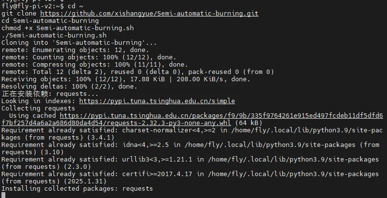

---

## 3. 安装完成后操作 (After Installation)

安装完成后脚本会自动打开，选择语言即可。  
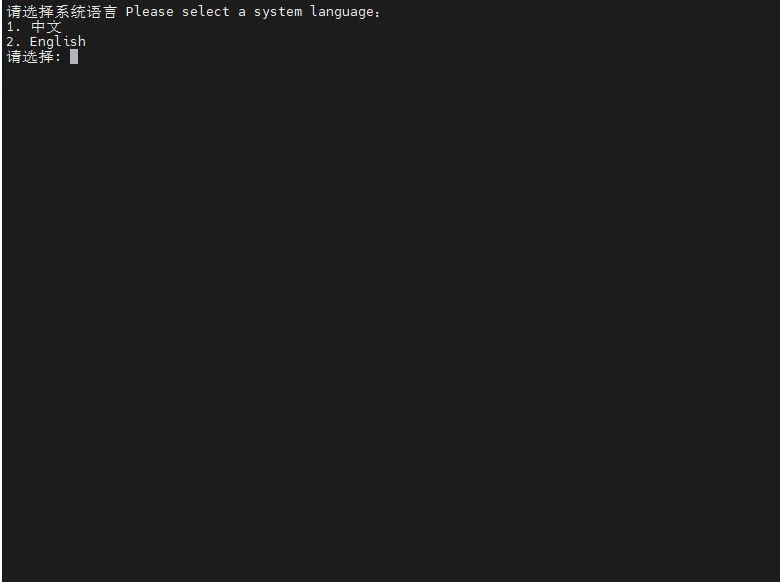

建议使用前先查看概述。  
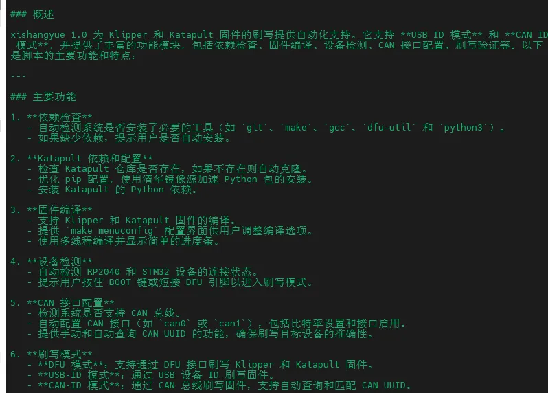

---

## 4. 主要选项说明 (Main Options Explanation)

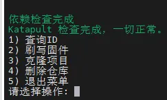

### 查询 ID 选项 (Query ID Option)

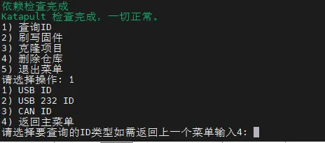

### 选择烧录方式 (Select Burning Method)

- 输入上位机密码后回车，密码是可见的 (Enter the host password and press Enter, the password is visible)

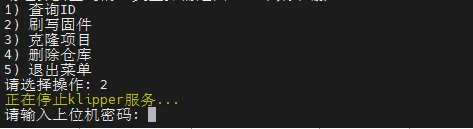

### 选择主板 MCU 类型 (Select Mainboard MCU Type)

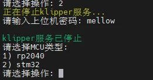

### 选择固件类型 (Select Firmware Type)

- 如果没有 BL 固件，选择 Katapult 原 `CANBOOT` (If there is no BL firmware, select Katapult original `CANBOOT`)

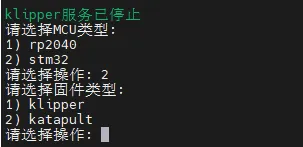

### 选择烧录模式 (Select Burning Mode)

- 有 BL 固件且有 USB-ID，选择 USB-ID 模式 (If there is BL firmware and USB-ID, select USB-ID mode)
- USB to CAN，选择 CANID 模式 (If it is USB to CAN, select CANID mode)
- CAN 板，直接选择 CANID 模式 (If it is a CAN board, directly select CANID mode)

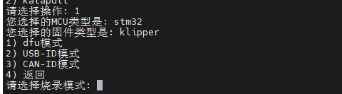

---

# USB-ID 模式演示 (USB-ID Mode Demonstration)

其他模式按照提示操作即可 (Follow the prompts for other modes)

## 自动进入固件配置界面 (Automatically Enter Firmware Configuration Interface)

- 配置主板固件后，输入 `Q Y` 回车 (After configuring the mainboard firmware, enter `Q Y` and press Enter)
- 自动编译固件 (Automatically compile the firmware)

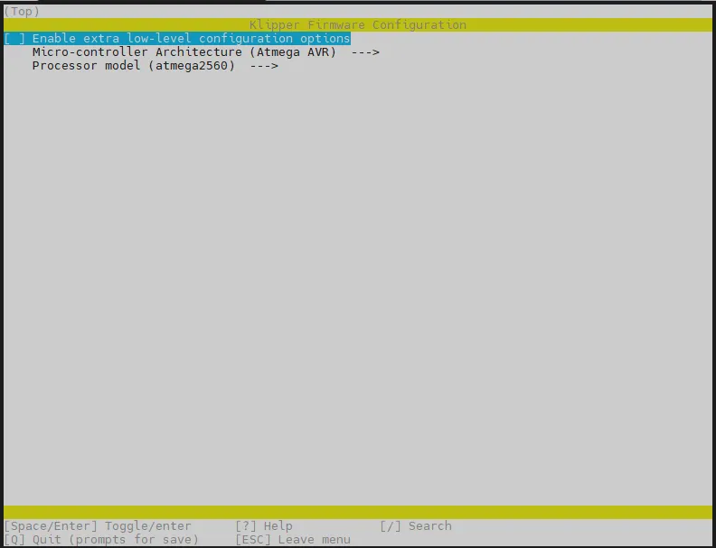
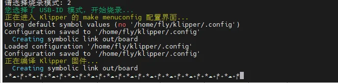

## 自动查询 ID (Automatically Query ID)

- 鼠标移动到 ID 上，双击左键后右键点击 `Paste`，回车 (Move the mouse cursor to the ID, double-click left, right-click `Paste`, then press Enter)

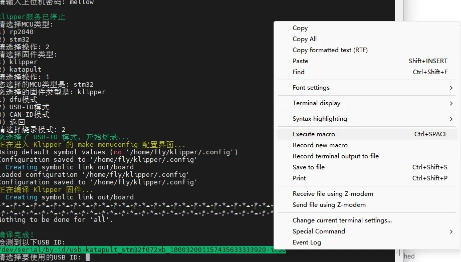

## 自动烧录固件 (Automatically Burn Firmware)

- 回车返回主界面 (Press Enter to return to the main interface)

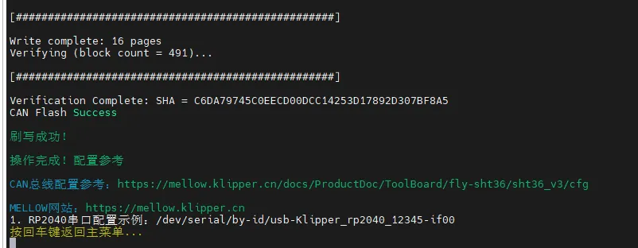
